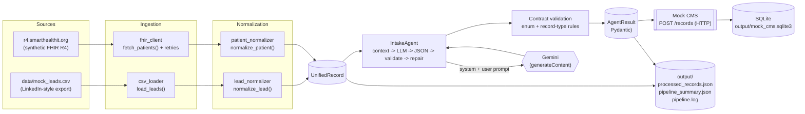
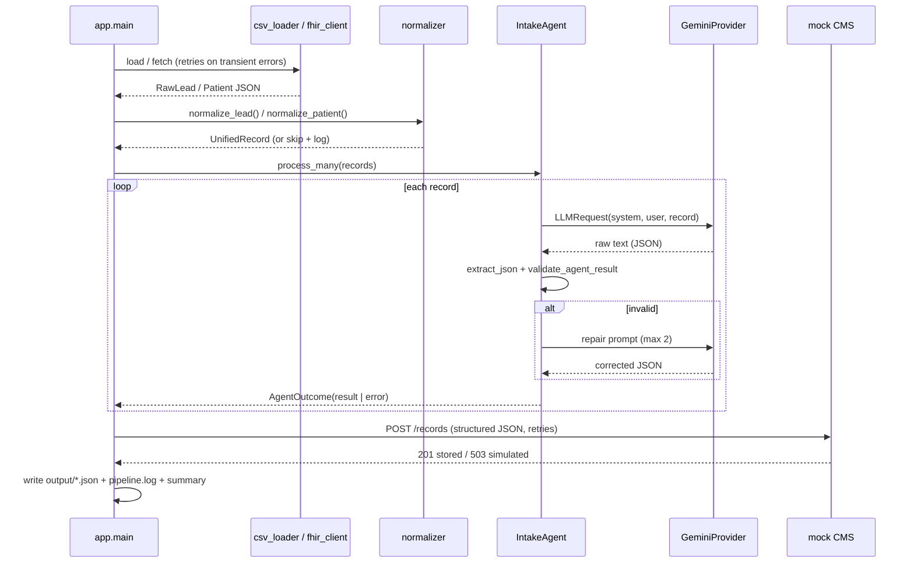

# Architecture — AI Lead & Patient Intake Pipeline

This document explains how the system is put together: the ingestion layer,
normalization layer, unified schema, agent layer, LLM provider, CMS
integration, error handling, logging, and the end-to-end data flow.

---

## 1. High-level data flow



The three pipeline stages from the assignment map to layers, and the fourth
(mock CMS) is an explicit **integration boundary**: the agent never calls a
Python function to "deliver" — it performs a real HTTP `POST`.

---

## 2. Ingestion layer

### 2.1 CSV loader (`app/ingestion/csv_loader.py`)

* **Inspects the header** instead of assuming column order; requires only
  `lead_id` and `full_name`, everything else is optional context.
* Normalizes empty cells to `None`, tolerates a UTF-8 BOM (Excel export),
  ignores cells beyond the header.
* Rows missing required fields are **skipped and logged**
  (`Record validation failed row=N` → `Skipping malformed record and
  continuing`); the run never aborts because of one bad row.
* Preserves the original raw cell values in `RawLead.raw_payload`.
* Never writes to the source file.
* Discovery: `discover_csv()` globs `data/mock_leads*.csv` (override with
  `LEADS_CSV_PATH` or `--csv`).

### 2.2 FHIR client (`app/ingestion/fhir_client.py`)

Async `httpx` client for `https://r4.smarthealthit.org` (no auth, synthetic
data only).

* Reads `GET /Patient?_count=N`, follows `link[relation=next]` up to
  `MAX_BUNDLE_PAGES`, and stops once the requested number is reached.
* Optional enrichment: `GET /Condition?patient=ID` when
  `FHIR_FETCH_CONDITIONS=true` (a failed Condition lookup degrades to a
  warning, never an abort).
* Failure classification:

| Condition | Classification | Behaviour |
|---|---|---|
| Timeout / connection error | retryable | bounded exponential backoff |
| HTTP 429 / 5xx | retryable | bounded exponential backoff |
| Other 4xx | non-retryable | raised immediately (retrying is pointless) |
| Malformed JSON body | retryable | bounded retry |
| Malformed resource (wrong type, missing `id`) | skip | logged, other resources continue |
| Zero usable resources | `FHIRClientError` | source reported as failed, pipeline continues |

* One bad resource can never crash the pipeline: validation happens per
  entry, and normalization errors are caught per record.
* The **raw FHIR JSON is preserved** in `UnifiedRecord.raw_payload`.

## 3. Normalization layer

Two independent normalizers, one shared output type:

| Module | Input | Output |
|---|---|---|
| `normalization/lead_normalizer.py` | `RawLead` (CSV row) | `UnifiedRecord(source=linkedin, record_type=lead)` |
| `normalization/patient_normalizer.py` | FHIR `Patient` (+ optional `Condition[]`) | `UnifiedRecord(source=fhir, record_type=patient)` |

Each raises `UnifiedRecordValidationError` on unusable input so the caller can
skip + log rather than propagate.

Design rule from the assignment: **do not force LinkedIn-specific and
healthcare-specific fields into one giant schema.** Shared fields live at the
top level; everything source-specific lives in the flexible `context` object.

## 4. Unified schema (`app/models/unified_record.py`)

```jsonc
{
  "id": "lead-001",                 // stable, prefixed per source
  "source": "linkedin",             // "linkedin" | "fhir"
  "record_type": "lead",            // "lead" | "patient"
  "person":      { "name", "role", "organization", ... },
  "contact_info":{ "email", "phone", "location", "linkedin_url", ... },
  "context":     { "summary", "facts": {...}, "tags": [...] },
  "priority_signal": "recent engagement with relevant content",
  "raw_payload": { ... },           // original CSV row / FHIR resource
  "ingested_at": "ISO-8601"
}
```

* `context.summary` is a one-line human summary; `context.facts` holds
  source-specific key/values (e.g. `recent_activity`, `condition_count`);
  `context.tags` carries signals like `engaged`, `intent`, `healthcare`.
* `raw_payload` guarantees **traceability back to the source record** and is
  deliberately **not** sent to the LLM.

## 5. Agent layer (`app/agent/`)

The assignment explicitly forbids "a single generic prompt that returns
arbitrary text", so the agent is a real per-record loop
(`agent.py :: IntakeAgent.process`):

1. **Prepare context** — `prompts.record_payload()` builds the model input
   from `person`, `contact_info`, `context`, `priority_signal` (never the raw
   payload).
2. **Call the LLM** — one system prompt (`prompts.SYSTEM_PROMPT`) + one user
   prompt (`build_user_prompt`).
3. **Extract JSON** — `extract_json()` tolerates markdown fences and finds the
   first balanced `{...}` object.
4. **Validate** — `models/agent_result.py :: validate_agent_result()` enforces
   the Pydantic schema **and** a record-type contract (lead → `HOT|WARM|COLD`
   and `SEND_OUTREACH|FOLLOW_UP|NURTURE|NO_ACTION`; patient → administrative
   classes and `FOLLOW_UP|SCHEDULE_OUTREACH|ADMIN_REVIEW|NO_ACTION`,
   `record_id` must echo the input id).
5. **Repair (bounded)** — on invalid output the agent sends
   `build_repair_prompt()` containing the validation error and the previous
   output. At most `MAX_REPAIR_ATTEMPTS = 2` repairs (3 calls max per record),
   then the record is marked failed and the batch continues.
6. **Log the decision** — classification, priority, action, channel, tone and
   the rationale are logged for every record.
7. **Return `AgentOutcome{record, result, error, llm_calls}`** — failures are
   data, not exceptions.

Prompt design lives in `prompts.py` and instructs the model to: use only
information present in the record, never invent facts, return only the
expected JSON, give a concise **decision rationale** (observable factors only,
no hidden chain-of-thought), and **never produce medical diagnosis or
treatment advice** for patient records.

## 6. LLM provider (`app/agent/llm.py`)

```
BaseLLMProvider (ABC)
├── GeminiProvider          # default, real inference over REST
├── OfflineProvider         # deterministic rules, explicit opt-in, no key
└── FaultInjectionProvider  # decorator: returns invalid JSON for N calls (demo)
```

* Everything Gemini-specific (URL, headers, `system_instruction`,
  `generationConfig.responseMimeType=application/json`, response parsing,
  friendly 401/404 messages) is isolated here — no other module imports
  Gemini details.
* Provider selection is a single factory, `build_llm_provider(settings)`:
  adding Ollama later means one new class + one branch, nothing else changes.
* Error taxonomy: `LLMRetryableError` (timeout, 5xx, malformed body) is
  retried by `retry_async`; `LLMFatalError` (bad key, unknown model, blocked
  prompt) fails fast with an actionable message. HTTP 429 is split by the
  server's `RetryInfo` hint: a short hint raises `LLMRateLimitError`
  (retried with exponential backoff, honouring the hint) while a long hint or
  daily-quota markers raise `LLMQuotaError` — **not retryable**, it fails
  fast and opens a per-run circuit so the remaining records are marked
  `quota_blocked` without further API calls (never an offline fallback).
* **No fake AI.** With `LLM_PROVIDER=gemini` and no key the pipeline exits
  before any network work with a clear `ConfigError`. `offline` must be
  selected explicitly and announces itself loudly in the logs.

## 7. CMS integration (`app/cms/client.py`)

* Async `httpx` client with the same retry policy as the other outbound calls.
* `health()` → `GET /health` (logged; failure does not stop deliveries).
* `deliver(result)` → `POST /records` with the JSON-serialized `AgentResult`
  (`simulate="once"|"always"` adds `X-Simulate-Error` for demos).
* `CMSDeliveryError` distinguishes transport failures (retryable) from
  validation responses (4xx, non-retryable — a bad payload is never retried).
* The mock CMS (`mock_cms/main.py`) validates with Pydantic
  (`CMSRecordCreate`) and upserts into SQLite by `record_id`, which makes
  redelivery **idempotent**.

## 8. Error handling

Central helpers: `utils/retry.py`

* `RetryPolicy(attempts, base_delay, max_delay, jitter)` — exponential backoff
  with jitter, always bounded.
* `retry_async()` — retries **only** `RetryableError`; `NonRetryableError`
  propagates immediately; every attempt logs
  `ERROR <op> failed attempt=n/N` → `WARNING Retrying request` →
  `INFO Request recovered on retry`, and finally
  `ERROR Giving up on <op> after N attempts`.
* `RetryStats` — shared mutable counters (`attempts`, `recoveries`,
  `exhausted`, per-label `failures`) feeding the pipeline summary.

Layer-by-layer policy:

| Layer | Failure | Behaviour |
|---|---|---|
| CSV | bad file | `CSVLoadError` → logged, source contributes 0 records |
| CSV | bad row | skipped + logged |
| FHIR | transient | retried with backoff |
| FHIR | permanent (4xx) | raised, source reported failed, run continues |
| FHIR | bad resource | skipped + logged |
| LLM | transport/API | retried; fatal errors reported per record |
| LLM | invalid JSON/schema | bounded repair prompt, then record marked failed |
| CMS | 5xx/timeout | retried; exhausted → that record fails, run continues |
| CMS | 4xx | no retry (payload is wrong) |

**Deliberate failure case:** `python -m app.main --demo-failure` injects a
malformed lead row, two malformed FHIR patients, a transient FHIR 503, one
invalid LLM response, a transient CMS 503 and a persistent CMS 503 — so every
path above is observable in a single run. Nothing is silently swallowed:
every failure appears in the logs **and** in `output/pipeline_summary.json`.

## 9. Logging / observability

`utils/logger.py` configures a single formatter (timestamp, level, module,
message) to the console **and** `output/pipeline.log`.

A run logs, in order: pipeline start → CSV loaded → FHIR fetched →
normalization counts → per-record processing start → classification → action →
rationale → LLM failures/repairs → CMS delivery success/failure → artifacts →
final summary.

Example:

```text
INFO  Pipeline started version=1.0.0 provider=gemini model=gemini-flash-latest
INFO  Loaded 18 LinkedIn leads from mock_leads.csv
INFO  Fetched 20 FHIR patients (pages=1)
INFO  Normalized 38 records in total
INFO  Processing record record_id=lead-001 source=linkedin type=lead
INFO  Agent classification=HOT action=SEND_OUTREACH priority=HIGH channel=linkedin tone=friendly record_id=lead-001
INFO  Rationale record_id=lead-001: High priority because ...
INFO  CMS delivery successful record_id=lead-001 status=stored
INFO  Pipeline completed total=38 processed_ok=38 failed=0 cms_delivered=38 ...
```

Sensitivity: raw healthcare payloads are **not** written to logs — only ids,
decisions, counters and rationales.

## 10. End-to-end data flow (one record)



## 11. Configuration

Everything is environment-driven (`app/config.py :: Settings.from_env()`),
optionally loaded from `.env`:

* immutable frozen dataclass → no hidden global mutation
* validation with actionable errors (bad int/bool/provider)
* fail-fast `require_llm_credentials()` before any network work
* CLI flags (`--csv`, `--cms-url`, `--fhir-count`, `--limit`, `--provider`,
  `--skip-*`, `--demo-failure`) become runtime overrides

## 12. Testing strategy

`tests/` (107 tests, no API key required):

| Area | Files |
|---|---|
| CSV loading / normalization | `test_csv_loader.py`, `test_lead_normalizer.py` |
| FHIR normalization | `test_patient_normalizer.py` |
| Unified schema validation | `test_unified_record.py` |
| AgentResult contract | `test_agent_result.py` |
| Agent loop + invalid-output repair | `test_agent.py` (LLM mocked) |
| Mock CMS endpoints | `test_mock_cms.py` |
| CMS HTTP client | `test_cms_client.py` |
| FHIR client + retries | `test_fhir_client.py` |
| Backoff / retry policy | `test_retry.py` |

Integration behaviour against the real sandbox or the real Gemini API is
exercised by running the pipeline, not by unit tests.
